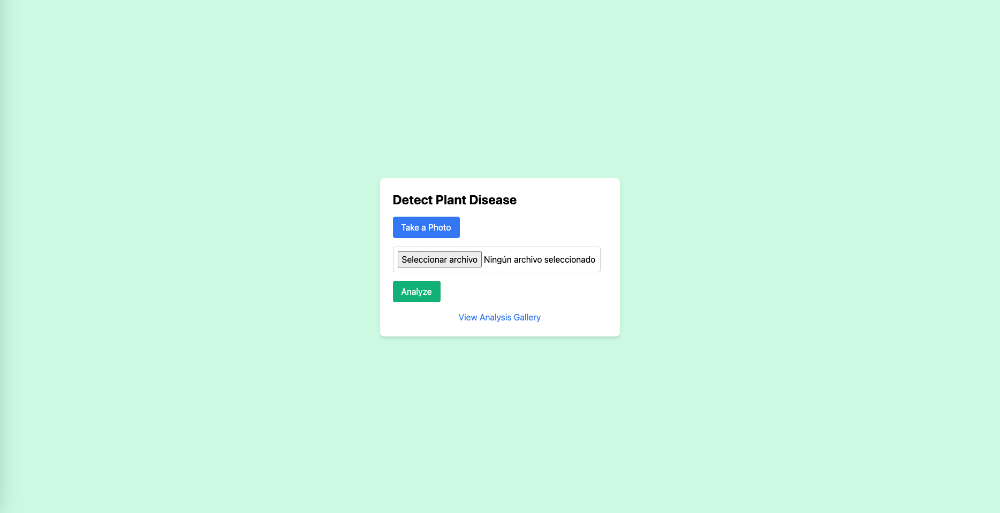
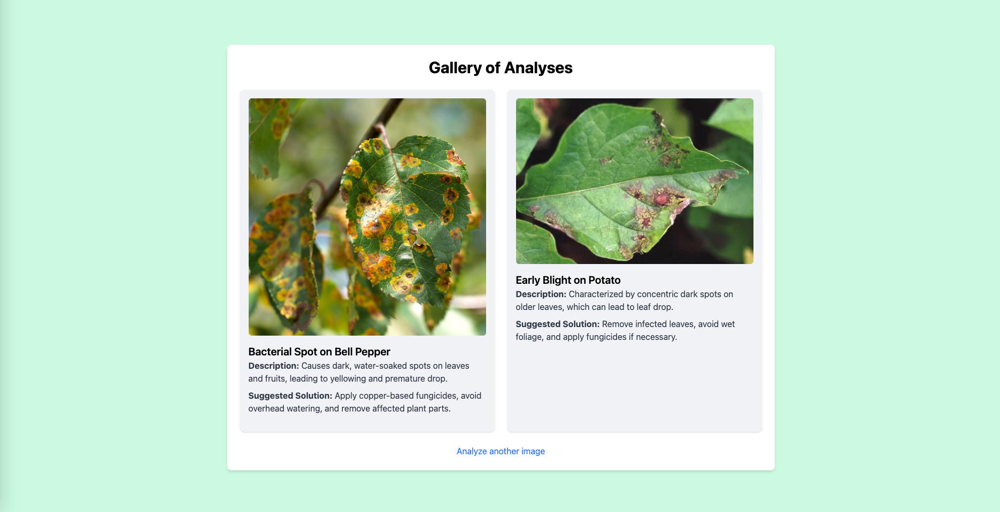

# Plant Disease Detection V2

The **Plant Disease Detection V2** is a machine learning model that uses deep learning to detect plant diseases in images. It is designed to be a fast and efficient tool for identifying plant diseases in images, making it a valuable asset for farmers, gardeners, and anyone else who needs to monitor their plants.

The model is trained on a large dataset of plant images, which includes images of various plant diseases. It uses convolutional neural networks (CNNs) to classify the images based on their content. The model is able to identify plant diseases with high accuracy, making it a valuable tool for identifying plant diseases in images.

This project was born from the [Plant Disease Detection project](https://github.com/joakimvivas/plant-disease-detector) and is a continuation of that project. The goal of this project is to improve the model's performance and make it more efficient.



## Architecture of the Project

This project allows the detection of plant diseases by analyzing images and using artificial intelligence and deep learning to classify common diseases in the leaves of different crops. The application integrates a backend developed in [FastAPI](https://fastapi.tiangolo.com/) and a simply frontend with HTML and TailwindCSS. The backend provides a RESTful API for interacting with the application, while the frontend is responsible for rendering the user interface and handling user interactions.

### Backend FastAPI Key Points

- **Performance and efficiency:** FastAPI is asynchronous and high-performance, which optimizes the handling of multiple requests simultaneously.
- **Ease of integration:** It allows you to easily integrate AI libraries and load pre-trained models, such as [ResNet-50](https://huggingface.co/microsoft/resnet-50), and offer fast answers in analysis.
- **Intuitive endpoints:** FastAPI allows you to build simple and well-documented endpoints to upload and process images, such as the /predict endpoints for analysis and /or gallery to view previous results.

### Frontend HTML Interface

The interface is simple and designed in HTML and TailwindCSS to offer a minimalist but functional design. This interface includes options to:

- **Capture or upload images:** This feature allows users to upload photos of leaves from their device or directly from the camera.
- **View previous analysis results:** A gallery page that shows the history of uploaded images and their respective diagnostics provides a visual and descriptive summary of each analysis.
- **Reset button for additional analysis:** Facilitates workflow by allowing multiple images to be analyzed quickly.



### Architecture of the AI Model: ResNet

We used [ResNet-50](https://huggingface.co/microsoft/resnet-50), a deep convolutional neural network, pre-trained on the ImageNet dataset. ResNet is one of the most popular and effective architectures for image classification tasks. The choice of this model is based on:

- **Model depth:** With 50 layers, [ResNet-50](https://huggingface.co/microsoft/resnet-50) can capture complex features of images, making it ideal for identifying subtle details between different types of leaf diseases.
- **Residual block structure:** Allows training deep networks without the problem of gradient degradation, optimizing accuracy.
- **Transfer Learning:** By using a pre-trained model, we can leverage visual features learned from other datasets, such as ImageNet, and fine-tune the model for the plant disease dataset, reducing the time and resources required for training.

## Running the project locally (How to Run)

1. Create the Python virtual environment

```sh
python3 -m venv plant-disease-detection
```

```sh
source plant-disease-detection/bin/activate
```

2. Install dependencies:

It is recommended, first, upgrade pip:
```sh
pip install --upgrade pip
```

Install dependencies/requirements:
```sh
pip install -r requirements.txt
```

3. Execute the following command:

```sh
uvicorn app.main:app --reload --host 0.0.0.0 --port 3000
```

4. You should see an output similar to:

```
INFO:     Uvicorn running on http://127.0.0.1:3000 (Press CTRL+C to quit)
INFO:     Started reloader process [XXXXX] using WatchFiles
INFO:     Started server process [XXXX]
INFO:     Waiting for application startup.
INFO:     Application startup complete.
```

## Licensing

All packages in this repository are open-source software and licensed under the [MIT License](https://github.com/joakimvivas/marco-bot/blob/main/LICENSE). By contributing in this repository, you agree to release your code under this license as well.

Let's build the future of **Plant Disease Detection V2** development together! 🤖🚀